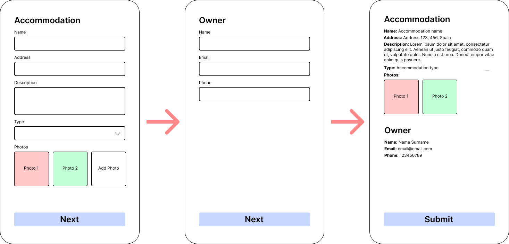

# Avantio React Challenge
Multi-Step Accommodation Creation Form.

## Main Goal
The main goal of this technical test is to develop a form for creating an accommodation.

The form consists of three steps, the first step is responsible for setting the accommodation data. The second step is responsible of the accommodation owner data. The last step is a summary of the two previous two steps.

We need a smooth transition between the steps and a random success/failure feedback message after submitting the form.

The components needs to be exported as CustomElement and fully integrated in the html attached `custom-form-result.html`, you can make the modifications that you consider to this file in order to make your component the more plug and play that you can.

## Technical requirements
- You have to use React + Typescript combination.
- You must use TailwindCSS.
- The output of this component is a CustomElement (WebComponent).

## Expected functionality
The form will have three steps:
1. Accommodation data.
2. Owner data.
3. Summary of the form.

We can only have one step at a time in the screen, we should have to navigate between them.

### First step

We will ask for the accommodation data as: name, location, description, type and pictures.

Field restrictions:
- Name: Required, length between 4 and 128 characters, numbers are not allowed.
- Address: Required, length between 4 and 128 characters.
- Description: Optional, if present, length between 128 and 2048 characters.
- Type: Required, only one of these values is allowed: apartment, villa or house.
- Photos: optional, if present, a maximum of two photos are allowed, dimension restrictions of 500x500.

The "Next" button is disabled until form completion and all validations are passed without problems, the field validation appears when you focus out the input.

### Second step

We will ask for the owner's details such as: name, email and phone number.

Field restrictions:
- Name: Required, Minimum 4 characters and maximum 64.
- Email: Required, must be an email containing "@" and a domain before the "@".
- Phone number: Optional, numbers only, up to 9 digits.

The submit button is disabled until form completion and all validations passed without problems, the field validation appears when focus out the input.

### Third step

In this step we will show a summary of the form, the submit button should emit an event to the DOM with all the information of this form.

## Additional considerations
We strongly recommend following the best practices for React and TailwindCSS.

The design and position of the elements in the forms are up to you but we appreciate an intuitive and easy to use user interface, take consideration about field requirements to prevent user mistakes.

## How to deliver the test
You can download the repository and push to a new one, then send us the link to your tech test. It's important for us to have the link as soon as possible, even if the test is not finished, you have to send us the link to the repository when it's created.